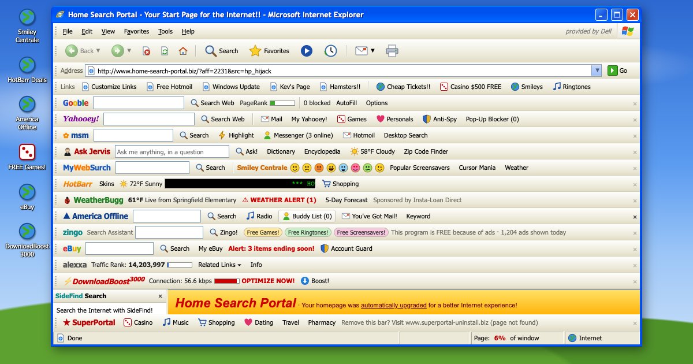

# Toolbar Season

**[oddurs.github.io/toolbar-season](https://oddurs.github.io/toolbar-season/)**

[](https://github.com/oddurs/toolbar-season/actions/workflows/deploy.yml)

Internet Explorer 6 on Windows XP, October 2005, when a free screensaver came with a toolbar and the toolbar came with three more.



Toolbar makers paid for every install, so every free download had one pre-ticked on the fourth screen of the installer. They changed your home page and your search engine, showed you ads, and watched where you went. Most people had several. Nobody remembers installing any of them.

You dial in to a browser that is 94% toolbar. Close them, scan for them, uninstall them. They come back, and they bring friends. It ends one of two ways:

- **The collapse.** Every toolbar there is gets installed, the page folds away to nothing, and Internet Explorer becomes a toolbar browser. About five minutes if you leave it alone; two if you click the ads.
- **The clean minute.** Get to zero third-party toolbars and keep it that way for one full minute. The uninstallers will fight you, and some toolbars leave a service behind that puts them back.

Either way you get a tally — toolbars you agreed to, toolbars that installed themselves, pop-ups that got through — and a line to paste somewhere.

Sound is on by default: the modem does the whole handshake, and BuddyBonz talks out loud.

## Things to find

- The toolbars' own buttons: punch the monkey, find 0 coupons, check the weather twice and get two different answers.
- **Tools › Add or Remove Programs**, and the uninstaller's exit survey.
- Right-click the page: every toolbar has added itself to the menu. Right-click the desktop, then install PC Speed Doctor and try again.
- Download something "free" and watch the transfer rate.
- BuddyBonz: jokes, "Daisy Bell", and Hide, which works for about a minute.
- Kev's homepage (sign the guestbook, play the MIDI), the TechGuyz help thread (post a reply and the moderator reads your toolbars), Windows Update, Hotmoil, a Skip Intro site, and The Hamster Party.
- Drag and resize the window. Some ads open behind it. Close IE and it leaves an icon on the desktop.

## Development

Svelte 5 + Vite, no runtime dependencies. Node 20+.

```sh
npm install
npm run dev       # dev server at http://localhost:5173
npm run build     # static build in dist/
npm run preview   # serve the build
npm test          # end-to-end and accessibility tests in Chrome, WebKit, Firefox and an iPhone
npm run og        # regenerate public/og.png, the link preview image
```

Add `?test` to the URL to switch off the random ads, pop-ups and self-installs and make loading instant; the tests use it. Pushing to `main` runs the tests, then builds and deploys to GitHub Pages.

- `src/lib/toolbars.js` — every toolbar, as data. Add one here.
- `src/lib/state.svelte.js` — the one reactive state object.
- `src/lib/actions.js` — everything that changes it: navigation, installs, pop-ups, the endings.
- `src/lib/buddy.js` — what BuddyBonz says and when.
- `src/lib/pages.js`, `src/components/pages/` — the fake 2005 web.
- `src/components/dialogs/` — pop-ups and XP dialogs.
- `tests/` — end-to-end and accessibility tests.

## Notes

Every toolbar, search engine, portal and forum in it is invented, and the whole thing is a parody. It isn't affiliated with Microsoft or anyone else, and no real company's software is included. The wallpaper is painted in code rather than lifted from the original photograph.

MIT licensed. Have at it.
